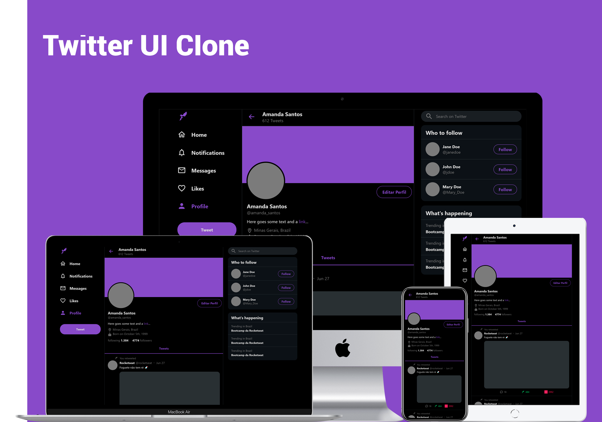
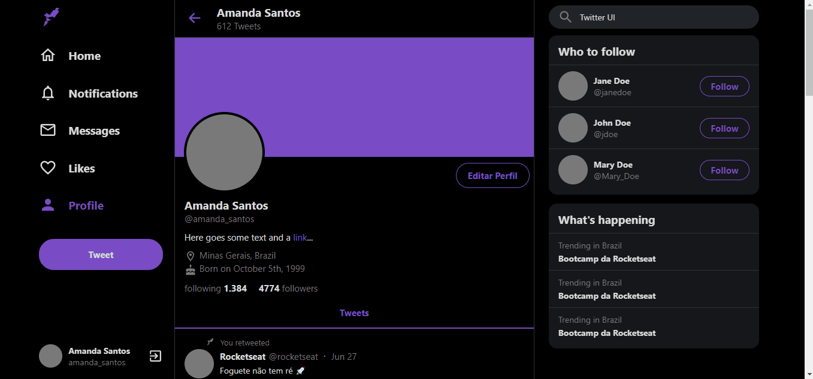
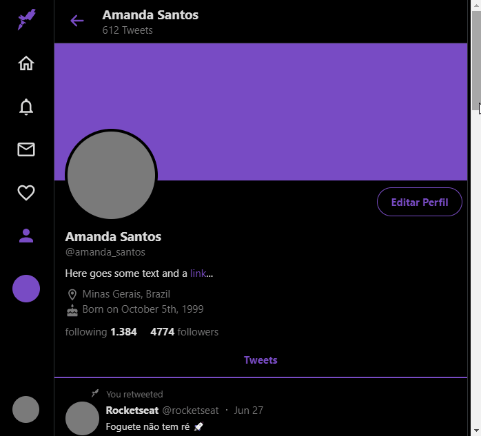
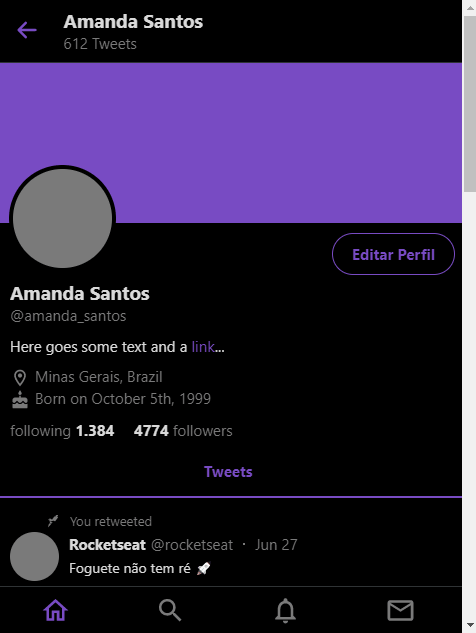

<h1 align="center">
    Twitter UI Clone
</h1>

	Twitter UI Clone (partial) for study purposes, fully responsive, made based on the video by Rocketseat.
	 
  Deployed <a href="https://twitter-uiclone.netlify.app">here</a>.

  
	
	

  <a href="#-techs">Techs</a>&nbsp;&nbsp;&nbsp;|&nbsp;&nbsp;&nbsp;
  <a href="#-techs">Preview</a>&nbsp;&nbsp;&nbsp;|&nbsp;&nbsp;&nbsp;
  <a href="#-usage">Usage</a>&nbsp;&nbsp;&nbsp;|&nbsp;&nbsp;&nbsp;
  <a href="#-contributing">Contributing</a>&nbsp;&nbsp;&nbsp;

## 👩🏻‍💻 Techs

This project was developed with the following technologies:

- React
- Styled Components
- TypeScript

## 💻 Preview

## 🖱 Usage

1.  Run  `npm install`  or  `yarn install`
2.  Run  `npm start` or `yarn start`  and access  `http://localhost:3000`

## 🤔 Contributing

1. *Fork* this repository (<https://github.com/amanda-santos/twitter-clone/fork>)
2. Create a _branch_ for your changes (`git checkout -b feature/fooBar`)
3. _Commit_ (`git commit -am 'Add some fooBar'`)
4. _Push_ (`git push origin feature/fooBar`)
5. Create a new _Pull Request_
